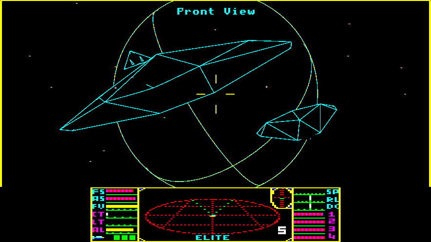
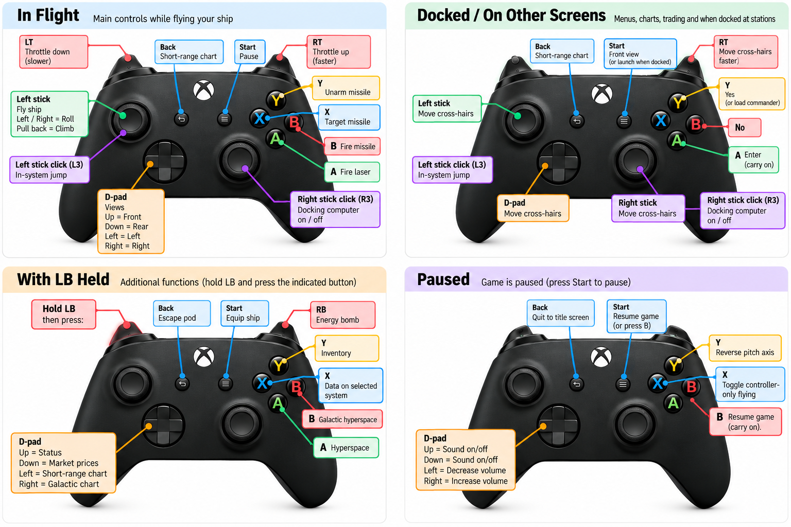

# EliteSharp

**Classic Elite, as it played on the BBC Master, rebuilt for modern Windows PCs.**



Elite is the 1984 space trading and combat game that started it all. You begin
with a Cobra Mk III, 100 credits and a tank of fuel, docked at the space station
orbiting Lave. From there the eight galaxies are yours: trade between the stars,
hunt pirates for bounties (or turn pirate yourself), take on missions for the
Navy, and work your way up the ranks from Harmless all the way to Elite.

EliteSharp is a faithful recreation of the BBC Master version of the game. The
ships, the universe, the markets, the combat and the missions all behave exactly
as they did in 1986. The difference is that it runs in a window on your PC, drawn
with crisp wireframes that you can scale up to fill your screen, and that you
can play it with an Xbox controller as well as the keyboard.

Space itself is drawn as a real 3D scene: the ships, stations and planets are 3D
models that your graphics card renders, still as Elite's classic wireframes, but
now with true perspective, planets that hide what's behind them, and a view that
fills a widescreen display.

## What you need

- A 64-bit Windows 10 or 11 PC
- The free [.NET 10 Runtime](https://dotnet.microsoft.com/download/dotnet/10.0)
  from Microsoft (if it isn't installed, the game offers to take you there)
- A graphics card with Vulkan 1.3 support (almost any card from the last ten years,
  with up-to-date drivers)
- Optionally, an Xbox controller (or any controller Windows recognises)

## Getting the game

Install the [.NET 10 Runtime](https://dotnet.microsoft.com/download/dotnet/10.0)
if you don't have it (on that page, it's the **.NET Runtime** download for
Windows x64). Then download the zip for the latest version from the
[Releases page](https://github.com/elaverick/EliteSharp/releases), unzip it
anywhere, and run `EliteSharp.exe` in the `EliteSharp` folder.

### Building the game yourself

To play the latest changes, or to work on the game, you can build it yourself,
which only takes a couple of minutes:

1. Install the free [.NET 10 SDK](https://dotnet.microsoft.com/download) from
   Microsoft.
2. Download the game, either with **Code → Download ZIP** on the GitHub page (then
   unzip it), or with Git:
   ```
   git clone https://github.com/elaverick/EliteSharp.git
   ```
3. Open a command prompt in the game's `src\EliteSharp` folder and run:
   ```
   dotnet run -c Release
   ```

After the first build, you'll find `EliteSharp.exe` in
`src\EliteSharp\bin\Release\net10.0`, and you can run that directly.

The missions are written in YAML in `src\EliteSharp\Assets\Missions` (see the
README there). The game reads them from the `Assets\Missions` folder next to
`EliteSharp.exe` when it starts, so you can change them or add your own there
without rebuilding the game (the build copies them from `src`). To run the tests, run `dotnet test` in the
`tests\EliteSharp.Tests` folder.

The game's fixed text (the screen titles, the commodity and equipment names,
the in-flight messages and so on) is in `src\EliteSharp\Assets\Strings\en-strings.yml`,
and the text it generates for each system (the "goat soup" descriptions and
the species) is in `en-descriptions.yml` beside it. The build copies them to
`Assets\Strings` next to `EliteSharp.exe`. A translation is another pair of
files named after its language (such as `fr-strings.yml` and
`fr-descriptions.yml`), which `--language fr` selects. The goods in the
markets and the equipment prices are in `src\EliteSharp\Assets\trading.yml`.

The sound effects are OGG files in `src\EliteSharp\Assets\Sounds`, recorded
from an emulation of the BBC Master's sound chip playing the original's sound
data (`python tools/render_sounds.py` makes them again). You can replace any
of them with your own OGG file, mono or stereo, with the same name.

## Starting out

When the game starts, it asks if you want to load a saved commander. Press
**N** to start a new career as Commander Jameson, then **Space** to go to your
ship.

A few tips for new pilots:

- **Launch** with **F1**. You'll fly out of the station's slot into space.
- **Trade** by buying goods cheaply in one system (**F2** while docked) and
  selling them for more in another (**F3**). Agricultural worlds sell food
  cheaply, and industrial worlds pay well for it. Look at a system's data
  (**F7**) to see what kind of economy it has. On the buy and sell screens,
  move up and down the list with the cursor keys, and use left and right (or
  type a number) to choose how much goes in your basket; **Y** fills it with as
  much as you can. Press **Return** to buy or sell everything in the basket, or
  **Escape** to empty it. Equipment (**F4** while docked) works the same way:
  pick an item and press **Return** to buy it.
- **Travel** by picking a destination on the short-range chart (**F6**) with the
  cursor keys, then pressing **H** to start the hyperspace countdown. You can
  jump as far as your fuel allows (up to 7 light years).
- **Docking** is the hardest thing in Elite. Fly towards the station, line
  yourself up with the slot, match the station's spin, and fly in slowly. Until
  you get the hang of it, save up for a **docking computer**. Press **C** to let
  it fly you in.
- **Save** your commander while docked by pressing the **`** key for the disc
  menu. Do this often!

## Keyboard controls

The game uses the original BBC Micro keys wherever possible. The BBC's red
function keys f0 to f9 are on your **F1** to **F10** keys.

### Flying

| Key | Action |
| --- | --- |
| **<** and **>** (the , and . keys) | Roll left and right |
| **S** and **X** | Dive and climb |
| **Space** and **?** (the / key) | Speed up and slow down |
| **A** | Fire laser |
| **T** | Target a missile |
| **M** | Fire the targeted missile |
| **U** | Unarm the missile |
| **E** | Fire the E.C.M. (destroys incoming missiles) |
| **Tab** | Set off the energy bomb |
| **J** | In-system jump (a quick hop towards the planet, if nothing is nearby) |
| **H** | Hyperspace to the selected system |
| **Ctrl + H** | Galactic hyperspace (needs a galactic hyperdrive) |
| **C** / **P** | Turn the docking computer on / off |
| **Escape** | Launch the escape pod |

### Screens

| Key | Docked | In flight |
| --- | --- | --- |
| **F1** | Launch | Front view |
| **F2** | Buy cargo | Rear view |
| **F3** | Sell cargo | Left view |
| **F4** | Equip ship | Right view |
| **F5** | Galactic chart | Galactic chart |
| **F6** | Short-range chart | Short-range chart |
| **F7** | Data on the selected system | Data on the selected system |
| **F8** | Market prices | Market prices |
| **F9** | Status | Status |
| **F10** | Inventory | Inventory |
| **`** | Save and load commanders | |
| **F12** | Settings | Settings |

On the charts, the **cursor keys** move the cross-hairs (hold **Shift** to move
them faster), **D** shows the distance to the selected system, **O** moves the
cross-hairs back to your current system, and **F** (while docked) lets you find
a system by typing its name.

### Pausing and options

Press **F11** (or **Pause**, or **End**) to pause the game. While paused:

| Key | Option |
| --- | --- |
| **Delete** or **Backspace** | Carry on playing |
| **Escape** | Quit to the title screen |
| **Q** / **S** | Sound off / on |
| **<** / **>** | Volume down / up |
| **Caps Lock** | Keyboard damping on / off |
| **A** | Keyboard auto-recentre on / off |
| **F** | Flashing console bars on / off |
| **X** | Show the authors' names on the title screen (and allow manual mis-jumps into witchspace) |
| **Y** | Reverse the controller's pitch axis |
| **J** | Reverse both controller axes |
| **K** | Controller-only flying (see below) |

Press **Alt + Enter** at any time to switch between a window and full screen.

### Settings

Press **F12** at any time (or **RB** on the controller while paused) for the
Settings screen, where you can switch between a window and full screen, change
the window's size and the screen's shape, turn vsync, smooth motion and the
controller on and off, and set the volume of the sound effects and music. Move
up and down with the cursor keys, change the highlighted setting with left and
right, and press **Escape** (or **B**, or **F12** again) to carry on playing.

Your settings are saved in `settings.yml` in the data folder
(`%APPDATA%\EliteSharp`, unless you use `--data`), along with the window's
size if you resize it and whether you switched to full screen with
**Alt + Enter**, and the game starts with them next time. The options below
override them for one run, without changing the file.

## Playing with a controller

Plug in an Xbox controller (or any controller Windows recognises) and it just
works, even while the game is running. You can use the keyboard and controller at
the same time.

The **left stick** flies the ship, just like the analogue joystick you could plug
into a BBC Master: push left and right to roll, and pull back to climb. The
**triggers** are your throttle: the harder you squeeze the **right trigger**, the
faster you speed up, and the **left trigger** slows you down. Let go of the
stick, and the keyboard takes over again. If you'd rather the stick was always in
charge, press **K** while paused.

On the charts, either stick moves the cross-hairs. On the buy and sell screens,
the D-pad or left stick moves up and down the list and changes how much is in
your basket; **A** buys or sells it, **B** empties it, and **Y** fills it with as
much as you can. On the equipment screen, **A** buys the highlighted item (and
picks the view for a laser), and **B** changes your mind about a laser. While
paused, **RB** opens the Settings screen.



You still need the keyboard for typing, such as naming your commander.

## Options

Most of the display settings are on the Settings screen too (see above). You
can add these options to the end of the command that starts the game, for
example `EliteSharp.exe --fullscreen --scale 3`, or add them to a Windows
shortcut:

| Option | What it does |
| --- | --- |
| `--fullscreen` | Start in full-screen mode |
| `--scale <1-8>` | The size of the window, as a multiple of the original screen size (default 4) |
| `--window <width>x<height>` | The size of the window in pixels, e.g. `--window 1920x1080` (any shape works; the 3D view fills the width) |
| `--frame 4:3` | Keep the display within the original's 4:3 frame, rather than stretching it to the full width of the window |
| `--simulation-rate <1-50>` | The game speed, in main loop updates per second (default 16, which feels like the original). The display is drawn once per screen refresh, whatever this is |
| `--novsync` | Draw the display as often as possible, rather than once per screen refresh (the game runs at the same speed either way) |
| `--nointerpolation` | Show each of the game's updates as it comes, rather than moving the 3D view smoothly between them (which shows the view up to one update late) |
| `--nosound` | Turn off the sound |
| `--nopad` | Ignore any game controllers |
| `--data <folder>` | Where to keep saved commanders |
| `--language <code>` | The language of the game's text, from `Assets\Strings\<code>-strings.yml` and `<code>-descriptions.yml` (default `en`) |
| `--game <folder>` | Play a mod: use the assets in this folder (usually a path relative to where you start the game) in place of the `Assets` folder (see below) |

### Mods

A mod is a folder laid out like the `Assets` folder next to `EliteSharp.exe`,
which `--game <folder>` (or `-game <folder>`) uses in its place, for example
`EliteSharp.exe --game mods\my-mod`. A mod only needs the files it changes;
anything it doesn't have comes from the `Assets` folder:

* `Strings`, `Images`, `Sounds` and `trading.yml`: each file the mod doesn't
  have (such as `Strings\en-strings.yml`) is the game's own.
* `Ships`: each ship type the mod doesn't define (by the `type` in its JSON
  file) is the game's own, and each model a ship uses (such as
  `Models\cobra-mk3.gltf`) comes from the mod if it has it, or else the game.
* `Missions`: if the mod has a `Missions` folder, its missions replace all of
  the game's (so an empty folder means no missions), and if it doesn't have
  `common.yml`, the game's is used. Without a `Missions` folder, the game's
  missions are used.

Your saved commanders live in `%APPDATA%\EliteSharp`, in a folder for each of the
game's "disc drives".

## Credits and thanks

**Elite was written by David Braben and Ian Bell**, and first published by
Acornsoft for the BBC Micro in 1984. The BBC Master version that EliteSharp
recreates was released by Acornsoft in 1986. Their game created a whole genre
and inspired generations of players and programmers, and EliteSharp exists
purely out of admiration for what they achieved.

**Ian Bell released the original source code for Elite** on his website, which
is what made a faithful recreation like this possible.

**Mark Moxon** has spent years turning that source code into a fully documented,
line-by-line commentary on how Elite works. His annotated BBC Master source
([github.com/markmoxon/elite-source-code-bbc-master](https://github.com/markmoxon/elite-source-code-bbc-master)),
and his wonderful website at [bbcelite.com](https://www.bbcelite.com), explain
every routine, every table and every trick in the game. EliteSharp was translated
from his commented code, and it was used at every step to check that the game
behaves exactly like the original. This project simply wouldn't exist without
his amazing work, so thank you, Mark.

EliteSharp also stands on the shoulders of:

- [Silk.NET](https://github.com/dotnet/Silk.NET), for Vulkan, windowing and input
- [SDL](https://www.libsdl.org), for game controller support
- [OpenAL Soft](https://openal-soft.org), for sound
- The Khronos Group, for [Vulkan](https://www.vulkan.org) and
  [glTF](https://www.khronos.org/gltf/), the format the ship models are stored in

EliteSharp is an unofficial, non-commercial fan project. It isn't affiliated
with, or endorsed by, David Braben, Ian Bell, Acornsoft or Frontier Developments.
Elite remains the work of its original authors.

Right on, Commander!
